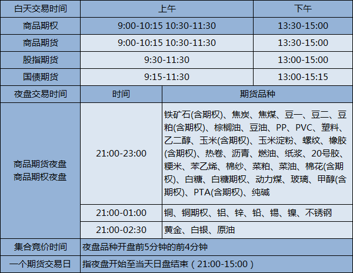

# 金融市场
* 证券
  * 股票
  * 债券
* 期权
* 期货
  * 股指期货
  * 商品期货
* 基金：成规模的资金
* 现货

# 中国有哪些期货交易所？
不同的交易所所拥有的期货种类完全没有交集。随便提一个期货名字，就可以查表得出这个期货所在的交易所。  
期货交易所一般既有期货产品又有期权产品，各个交易所的期货产品可以在其官方首页上查询。  

## 上海期货交易所
上海期货交易所成立于1990年11月26日，设有黄金、白银、螺纹钢、沪铜、沪锡等16个期货品种和铜期权、天然橡胶期权这2个期权品种。上海期货交易所的英文缩写是shfe，[官网地址](http://www.shfe.com.cn/products/sc/)

它的期货产品包括：  
燃油,原油,沪铝,橡胶,沪锌,沪铜,黄金,螺纹钢,线材,沪铅,白银,沥青,热轧卷板,沪锡,沪镍,纸浆,20号胶,不锈钢
上海期货种类分为3类：
* 金属：沪铝,沪锌,沪铜,黄金,螺纹钢,沪铅,白银,沪锡,沪镍,,不锈钢，热轧卷板。热轧卷板是钢铁的一种加工品。
* 油：燃油
* 胶：橡胶,线材,沥青,纸浆

## 上海国际能源交易中心
上海国际能源交易中心是隶属于上海期货交易所的分支机构，于2013年11月22日正式成立，在经历5年时间的漫长筹备后，原油期货于2018年3月26日在上海国际能源交易中心正式挂牌成立，而原油期货目前也是该交易所的唯一期货品种。
上海国际能源交易中心英文缩写是INE，[官网](http://www.ine.cn/products/oil/)

它的期货产品包括：  
原油和20号胶

这两个期货也在上海期货交易所上市。  

## 中国金融期货交易所
2006年9月8日，中金所在上海正式成立，是继上期所、郑商所、大商所成立后的中国第四大交易所，目前可交易的品种有股指期货和国债期货。

中国金融期货交易所英文缩写为cffex，[官网地址](http://www.cffex.com.cn/rtj/)。

它的产品包括：
沪深300指数期货,上证50指数期货,中证500指数期货,2年期国债期货,5年期国债期货,10年期国债期货

可以分为两大类：
* 权益类：沪深300指数期货,上证50指数期货,中证500指数期货
* 利率类：2年期国债期货，,5年期国债期货,10年期国债期货
## 郑州商品交易所
郑商所是我国成立的第一个期货交易所，成立于1990年10月12日，可交易的品种包括棉花、白糖、PTA、甲醇等18个期货品种，以及白糖期权和棉花期权这两个期权品种。郑商所大部分都是农产品期货，所以想做农产品期货的朋友们不要错过了~
郑州商品交易所简称为czce，[官网](http://www.czce.com.cn/)

PTA,菜油,菜籽,菜粕,动力煤,强麦,粳稻,白糖,棉花,早籼稻,郑醇,玻璃,晚籼稻,硅铁,锰硅,棉纱,鲜苹果,红枣,尿素,纯碱

郑州的期货种类可以分成三种：
* 农产品类。河南是农业大省，因此主要品类都是农作物。
* 矿产资源。动力煤，硅铁,锰硅。
* 工业原材料。PTA，郑醇,玻璃，尿素,纯碱。PTA是精对苯二甲酸的简称，主要用于制造合成聚酯树脂、合成纤维和增塑剂等。

## 大连商品交易所
1993年2月28日大连商品交易所在辽宁省大连市正式成立，目前大商所可以上市交易的有包括玉米、豆粕、焦煤、焦炭等17个期货品种。除此之外，大商所还可以交易豆粕期权和玉米期权。
[官网地址](http://www.dce.com.cn/dalianshangpin/xqsj/tjsj26/rtj/rxq/index.html)
PVC,棕榈,豆二,豆粕,铁矿石,鸡蛋,塑料,PP,纤维板,胶合板,豆油,玉米,豆一,焦炭,焦煤,玉米淀粉,乙二醇,粳米,苯乙烯。

大连期货种类分为三种：
* 农产品类：棕榈,豆二,豆粕，鸡蛋,豆油,玉米,豆一,玉米淀粉,粳米。这里的豆一，豆二指的是黄大豆1号和黄大豆2号。
* 工业原材料：PVC,塑料,PP,纤维板,胶合板，乙二醇,苯乙烯。PVC就是大名鼎鼎的聚氯乙烯。
* 矿产资源：铁矿石,焦炭,焦煤。

# 现货交易所
现货交易也同理，当我们进行现货交易时，也应当在交易所进行，并且通过中间的现货公司。但要强调的是，国内受国家级监管的现货交易所有且只有一家，它叫做：上海黄金交易所。

# 商品期货的命名
商品期货的命名有规律，大都是英文缩写+数字。数字有两种含义：
* 连续命名：如M0  
* 年月命名：M2006,表示2020年06年到期的期货

# 期货交易时间
期货交易市场并非总是开门，而是有特定的交易时间。    
